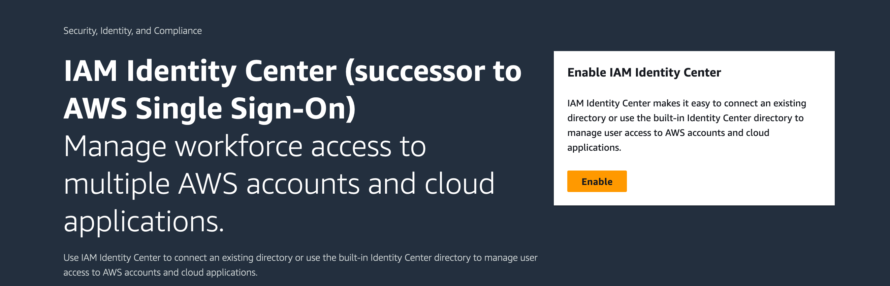
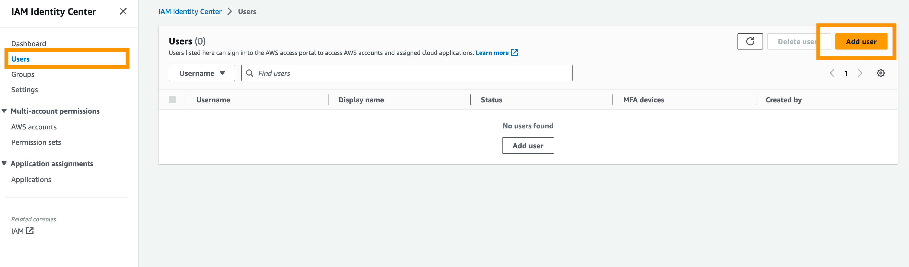
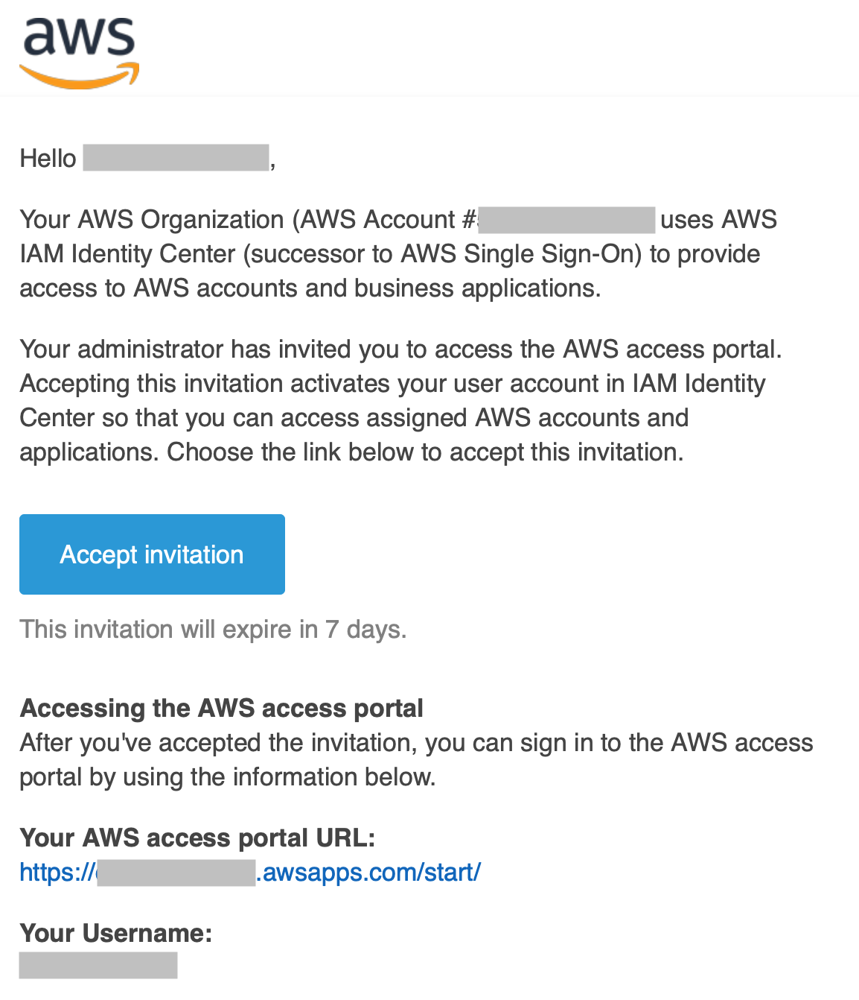

# Setup of the Data Visualization Using Grafana

## Deployment 


Most of the deployment is done automatically by the `meter-data-analytics` stack, however you still need to configure the following things **before** the deployment.


The `stack-parameter.json` file require an additional parameter to define the authentication provider for Amazon Managed Grafana:
- Allowed values are `AWS_SSO` (preferred) or `SAML`. If you choose `AWS_SSO` your account has to be part of an organization, because it is a requirement in order to use the IAM Identity Center, which is used for SSO. If your account is not part of an organization the deployment will fail. Otherwise if you choose `SAML`, you will need to configure the SAML provider after the deployment (see below).

``` 
    {
      "ParameterKey":"GrafanaDashboardAuthenticationProvider",
      "ParameterValue":"AWS_SSO"
    }
```

## Enabling AWS IAM Identity Center (SSO)
If you choose the SSO option, you need to enable the [AWS IAM Identity](https://aws.amazon.com/iam/identity-center/) Center in the account you are deploying the MDA first.

1. Navigate to the [AWS IAM Identity Center console](https://us-east-1.console.aws.amazon.com/singlesignon/home)
2. If not already done, press the 'Enable' button.

3. Afterwards a user needs to be created:

4. Wait for an email to activate the user:


## Viewing the Dashboard

In order to view the dashboards after the workspace is created head over to [Amazon Managed Grafana](https://console.aws.amazon.com/grafana). 

1. Select the workspace `AmazonGrafanaWorkspace` created by the AWS CloudFormation stack.

Now you have to configure user access based on the authentication provider you have selected.

### AWS IAM Identity Center

2. Assign a new user or group using the `AWS IAM Identity Center`. For more information, refer to [Managing user and group access to Amazon Managed Grafana](https://docs.aws.amazon.com/grafana/latest/userguide/AMG-manage-users-and-groups-AMG.html).

3. Click on the Grafana workspace URL, sign in, and you are able to view the dashboards, which are stored in the `General` folder.

### SAML using Okta as an IDP

2. A detailed guide of setting up Okta as an IDP for Grafana is provided [here](https://catalog.us-east-1.prod.workshops.aws/workshops/0ee4408e-818a-4774-b03d-bf68bfc016ac/en-US/digital-twin/okta-saml).

3. Click on the Grafana workspace URL, sign in, and you are able to view the dashboards, which are stored in the `General` folder.